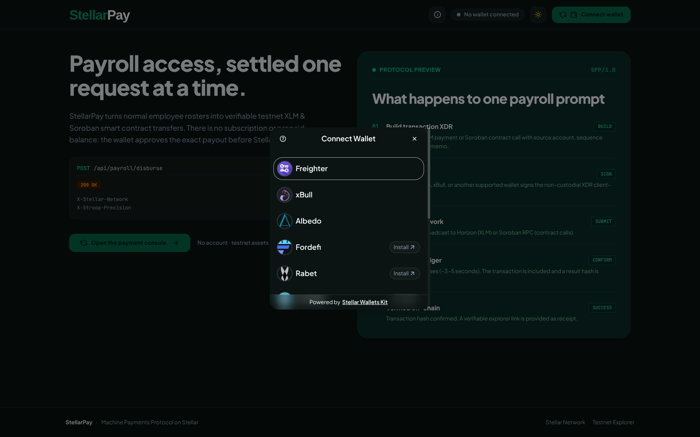
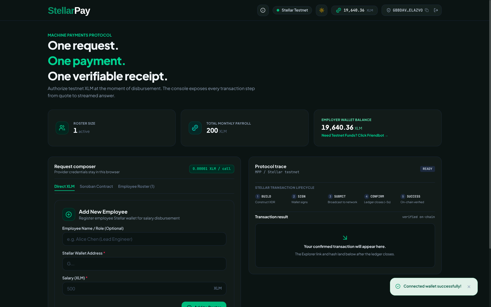
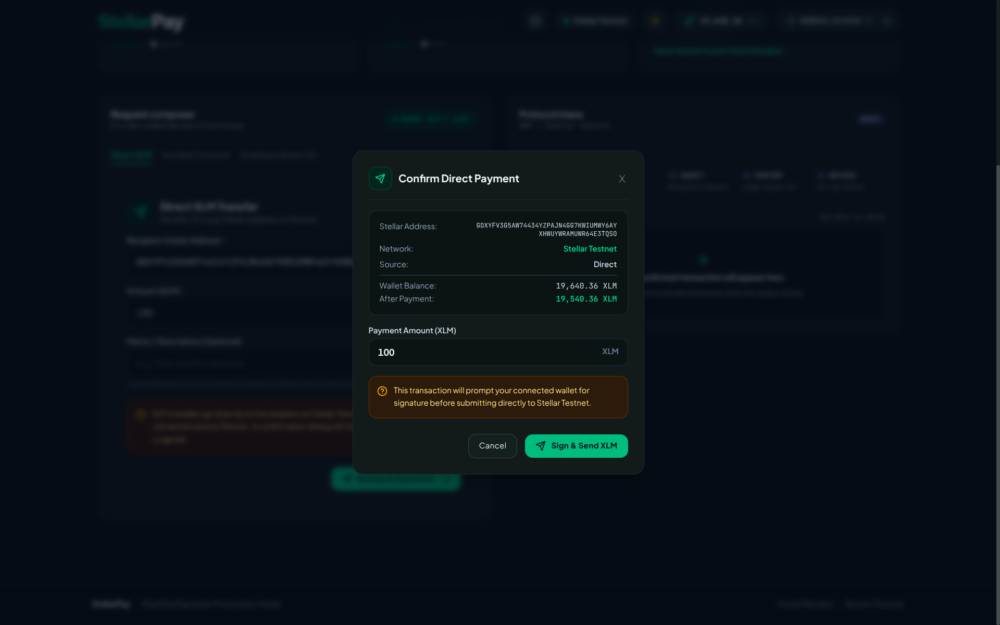
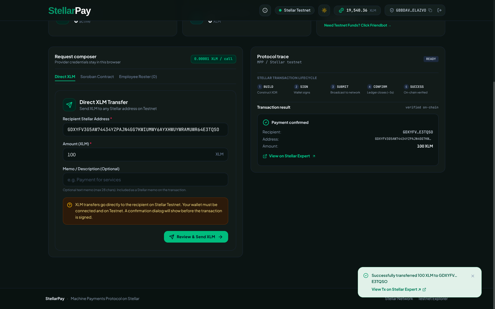

# StellarPay

**StellarPay** is a decentralized payroll and salary distribution platform built on **Stellar Testnet** with a **Soroban smart contract**. It allows employers to manage employee rosters, execute direct or bulk XLM salary payments, and track payroll cycles — all from a mobile-responsive web app with non-custodial wallet signing.

> **Quick Stats:** 8 wallets supported | 67 frontend tests | 10 Soroban event types | 3 custom error classes | CI/CD pipeline

### Tech Stack

| Layer | Technology | Version |
|---|---|---|
| Frontend | React + TypeScript | 19.2.7 / ~6.0.2 |
| Build | Vite + Tailwind CSS | 8.1.1 / 4.3.3 |
| Wallet | `@creit-tech/stellar-wallets-kit` | JSR latest |
| Freighter API | `@stellar/freighter-api` | 6.0.1 |
| Stellar SDK | `@stellar/stellar-sdk` | 16.1.0 |
| Smart Contract | Rust + Soroban SDK | 27.0.0 |
| Testing | Vitest (frontend) + Cargo test (contract) | 4.1.10 |
| Linting | oxlint | 1.71.0 |
| CI/CD | GitHub Actions | — |

---

## Contract

| Field | Value |
|---|---|
| **Contract ID** | `CASTP46VFFVDQ77FUIDTTTXBBGYIX4YZTANUIVYGGVDXC67UL7VEVLTV` |
| **Soroban RPC** | `https://soroban-testnet.stellar.org` |
| **Horizon** | `https://horizon-testnet.stellar.org` |
| **Explorer** | [View on Stellar Expert](https://stellar.expert/explorer/testnet/contract/CASTP46VFFVDQ77FUIDTTTXBBGYIX4YZTANUIVYGGVDXC67UL7VEVLTV) |
| **Package** | `stellarpay-payroll` v0.1.0 |
| **Native SAC (pinned token)** | `CDLZFC3SYJYDZT7K67VZ75HPJVIEUVNIXF47ZG2FB2RMQQVU2HHGCYSC` |

### Contract Functions

| Function | Description |
|---|---|
| `initialize(admin, token)` | Set admin and pinned payroll token (native SAC) |
| `add_employee(employee, salary)` | Add employee to roster (admin only) |
| `remove_employee(employee)` | Remove employee from roster (admin only) |
| `update_employee_salary(employee, new_salary)` | Update salary (admin only) |
| `set_employee_active(employee, active)` | Activate/deactivate employee (admin only) |
| `pay_salaries()` | Execute salary payouts to all unpaid active employees (admin only) |
| `next_cycle()` | Advance to next payroll cycle — blocked if unpaid remain (admin only) |
| `withdraw(to, amount)` | Recover excess contract balance (admin only) |
| `set_paused(paused)` | Emergency pause/unpause (admin only) |
| `transfer_admin(new_admin)` | Transfer admin role (admin only) |
| `get_admin` / `get_token` / `is_paused` / `get_cycle` | Read-only getters |
| `get_employee` / `get_employees` / `get_total_payroll` / `get_unpaid_payroll` | Roster queries |

### Contract Events

| Event | Emitted When |
|---|---|
| `sal_paid` | An employee receives their salary |
| `cyc_done` | A full payroll cycle completes |
| `cyc_next` | Admin advances to the next cycle |
| `emp_add` | A new employee is added |
| `emp_rm` | An employee is removed |
| `emp_upd` | An employee's salary is updated |
| `emp_act` | An employee is activated/deactivated |
| `pause` | Contract is paused/unpaused |
| `adm_xfer` | Admin role is transferred |
| `withdraw` | Tokens are withdrawn from the contract |

### Contract Error Codes

| Code | Name | Description |
|---|---|---|
| 1 | `AlreadyInitialized` | Contract already initialized |
| 2 | `NotInitialized` | Contract not yet initialized |
| 3 | `Unauthorized` | Caller is not the admin |
| 4 | `DuplicateEmployee` | Employee already in roster |
| 5 | `EmployeeNotFound` | Employee not in roster |
| 6 | `InvalidSalaryAmount` | Salary must be positive |
| 7 | `InsufficientContractBalance` | Not enough tokens in contract |
| 8 | `AlreadyPaidThisCycle` | Employee already paid this cycle |
| 9 | `ContractPaused` | Contract is paused |
| 10 | `MaxEmployeesReached` | Max 50 employees |
| 11 | `NothingToWithdraw` | Amount must be positive |
| 12 | `UnpaidEmployeesRemain` | Cannot advance cycle with unpaid employees |

---

## Features

- **Multi-wallet support** — Connect with Freighter, Albedo, xBull, Lobstr, Hana, Rabet, HOT Wallet, or Klever
- **Direct XLM payments** — Send XLM to any Stellar address on Testnet
- **Soroban payroll contract** — Manage employees, salaries, and cycles on-chain
- **Real-time event streaming** — Live contract events via Soroban RPC polling
- **Auto-reconnect** — Wallet session persists across page reloads
- **Balance display** — Live XLM balance in header and dashboard
- **Friendbot funding** — One-click testnet account funding
- **Emergency pause** — Contract admin can pause payroll operations
- **Transaction feedback** — Toast notifications with Stellar Expert links
- **Mobile-responsive UI** — Dark/light theme with Tailwind CSS

---

## Product Walkthrough

### 1. Connect a supported wallet

Open the wallet selector to connect Freighter, xBull, Albedo, or another supported Stellar wallet. The application keeps signing non-custodial: account access and transaction approval remain inside the selected wallet.



### 2. Review the connected payroll console

After connecting on Stellar Testnet, the console displays the active network, employer XLM balance, local roster size, and monthly payroll total. Direct XLM transfers, Soroban contract payroll, and employee management remain separate workflows.



### 3. Review and authorize a direct payment

Before submission, StellarPay presents the complete recipient address, network, payment source, current wallet balance, and projected balance. The connected wallet must explicitly sign before the XLM payment is broadcast.



### 4. Verify settlement on-chain

Once the ledger confirms the transaction, the dashboard shows the recipient, amount, updated wallet balance, and a direct Stellar Expert receipt link. The recipient is paid directly without being added to or changing the employee roster.



---

## Level 1 — Wallet, Contracts, Transactions, Multi-Wallet

> **Checklist** — All 5 requirements met:
> - [x] Freighter wallet setup on Stellar Testnet
> - [x] Wallet connect + disconnect
> - [x] XLM balance fetch + display
> - [x] XLM transaction with success/failure feedback + tx hash
> - [x] Dev standards (UI, wallet, balance, tx, error handling)

### 1. Wallet Setup

| Requirement | Implementation |
|---|---|
| Freighter wallet | `@stellar/freighter-api` v6.0.1 with `@creit-tech/stellar-wallets-kit` for multi-wallet support |
| Stellar Testnet | Hardcoded via `Networks.TESTNET` — Horizon (`horizon-testnet.stellar.org`) and Soroban RPC (`soroban-testnet.stellar.org`) |
| Network guard | `assertTestnet()` runs before every signing/submission to enforce Testnet-only operation |

**Key files:** `frontend/src/config.ts`, `frontend/src/lib/wallet.ts`

### 2. Wallet Connection

| Requirement | Implementation |
|---|---|
| Connect | `connect()` opens the StellarWalletsKit auth modal — supports 8 wallets |
| Disconnect | `disconnect()` clears localStorage and resets all wallet state |
| Auto-reconnect | On app load, reads `stellarpay.active_wallet` from localStorage, verifies network, and restores session |
| State management | `useWallet` hook exposes `address`, `balance`, `network`, `connecting`, `loadingBalance`, `error` |

**Key files:** `frontend/src/hooks/useWallet.ts`, `frontend/src/lib/wallet.ts`

### 3. Balance Handling

| Requirement | Implementation |
|---|---|
| Fetch XLM balance | `getXlmBalance(address)` calls `server.loadAccount(address)` and finds `asset_type === "native"` |
| Display | XLM balance shown in the header `WalletBar` (with loading spinner) and the Employer Wallet Balance card on the dashboard |
| Auto-refresh | Balance updates after connect, payment sent, and Friendbot funding |

**Key files:** `frontend/src/lib/stellar.ts` (`getXlmBalance`), `frontend/src/hooks/useWallet.ts` (`refreshBalance`)

### 4. Transaction Flow

| Requirement | Implementation |
|---|---|
| Send XLM | `sendXlm()` builds a `TransactionBuilder` with `Operation.payment()`, signs via Freighter, submits via Horizon |
| Success feedback | Toast notification: green checkmark, "Paid {amount} XLM to {name}", with clickable [Stellar Expert](https://stellar.expert) link |
| Failure feedback | Toast notification: red error icon, error message with descriptive reason |
| Transaction hash | Returned from `submitTransaction()` and embedded in the Stellar Expert explorer link |
| Duplicate guard | `pendingTxns` Set prevents concurrent transactions from the same address |
| Pre-flight check | Verifies sender has sufficient XLM (amount + 1 XLM reserve) before submitting |

**Key files:** `frontend/src/lib/stellar.ts` (`sendXlm`), `frontend/src/App.tsx` (`handlePay`)

### 5. Development Standards

| Requirement | Implementation |
|---|---|
| UI setup | React 19 + TypeScript + Vite 8 + Tailwind CSS 4 |
| Wallet integration | Multi-wallet kit wrapping Freighter + 7 other wallets with theme sync |
| Balance fetch | Horizon SDK `loadAccount` with 404 handling for unfunded accounts |
| Transaction logic | Full pipeline — validation, network guard, balance check, build, sign, submit |
| Error handling | Custom error classes (`WalletError`, `StellarError`, `SorobanError`), try/catch on every async path, toast notifications for all user-facing errors |
| Testing | Vitest unit tests covering wallet, Stellar SDK, and Soroban integration |
| Linting | oxlint with React hooks rules |
| CI | GitHub Actions pipeline — Rust contract build/test, frontend lint/test/build |

**Key files:** `frontend/src/lib/stellar.ts`, `frontend/src/lib/wallet.ts`, `frontend/src/lib/soroban.ts`, `frontend/src/__tests__/`

---

## Level 2 — Multi-wallet, Contracts & Events, Writing Contract

> **Checklist** — All requirements met:
> - [x] 3 error types handled
> - [x] Contract deployed on testnet
> - [x] Contract called from the frontend
> - [x] Transaction status visible
> - [x] 2+ meaningful commits
> - [x] Multi-wallet support
> - [x] Real-time event integration

### 1. Three Error Types Handled

| Error Class | Location | Handles |
|---|---|---|
| `WalletError` | `frontend/src/lib/wallet.ts:20` | Wallet connection failures, wrong network, user rejection |
| `StellarError` | `frontend/src/lib/stellar.ts:18` | Invalid public keys, insufficient balance, Horizon submit failures, validation errors |
| `SorobanError` | `frontend/src/lib/soroban.ts:30` | Contract ID missing, simulation errors, RPC submission failures, polling timeouts, on-chain failures |

Every async path has try/catch with descriptive error messages surfaced to the user via toast notifications. The `ErrorBoundary` component (`frontend/src/components/ErrorBoundary.tsx`) catches React rendering errors with a fallback UI.

### 2. Contract Deployed on Testnet

| Detail | Value |
|---|---|
| Contract ID | `CASTP46VFFVDQ77FUIDTTTXBBGYIX4YZTANUIVYGGVDXC67UL7VEVLTV` |
| Package | `stellarpay-payroll` v0.1.0 |
| Soroban SDK | 27.0.0 |
| Deploy script | `scripts/deploy.sh` — builds WASM, deploys via `stellar contract deploy`, optionally initializes |
| Explorer | [View on Stellar Expert](https://stellar.expert/explorer/testnet/contract/CASTP46VFFVDQ77FUIDTTTXBBGYIX4YZTANUIVYGGVDXC67UL7VEVLTV) |

### 3. Contract Called from the Frontend

The frontend calls the contract via `invokeContractCall()` in `frontend/src/lib/soroban.ts`. This function:
1. Validates the contract ID is set
2. Asserts Testnet-only operation
3. Builds a Soroban transaction with the contract call
4. Simulates via Soroban RPC
5. Signs via Freighter wallet
6. Submits and polls for confirmation (up to 30 retries)
7. Returns the transaction hash

Read-only calls use `simulateRead()` for gas-free queries (admin, cycle, token, paused status, payroll totals).

**Key file:** `frontend/src/lib/soroban.ts`

### 4. Transaction Status Visible

| Status | UI Feedback |
|---|---|
| Direct XLM payment success | Toast: green checkmark + amount + recipient + [Stellar Expert](https://stellar.expert) link |
| Direct XLM payment failure | Toast: red error icon + error message |
| Contract call success | Toast: green checkmark + transaction hash |
| Contract call failure | Toast: red error icon + SorobanError message |
| Wallet connection error | Error state in `useWallet` hook, displayed in UI |
| Insufficient balance | Pre-flight check throws `StellarError` before submission |

### 5. Meaningful Commits (2+ required)

| Date | Commit | Description |
|---|---|---|
| 2026-07-23 | `92769e7` | `feat(level-1): implement Freighter wallet payroll payments` |
| 2026-07-23 | `fdabd22` | `feat(level-2): deploy Soroban payroll contract and admin dashboard` |
| 2026-07-23 | `d59fbdd` | `feat(level-3): complete payroll dApp with tests, events, and CI/CD` |
| 2026-07-24 | `0d7c690` | `fix: some bugs` |
| 2026-07-24 | `d60237f` | `fix: remove unused EMP constant in soroban-integration test` |

### 6. Multi-wallet Support

StellarPay supports **8 wallets** via `@creit-tech/stellar-wallets-kit`:

| Wallet | Module |
|---|---|
| Freighter | `@creit-tech/stellar-wallets-kit/modules/freighter` |
| Albedo | `@creit-tech/stellar-wallets-kit/modules/albedo` |
| xBull | `@creit-tech/stellar-wallets-kit/modules/xbull` |
| Lobstr | `@creit-tech/stellar-wallets-kit/modules/lobstr` |
| Hana | `@creit-tech/stellar-wallets-kit/modules/hana` |
| Rabet | `@creit-tech/stellar-wallets-kit/modules/rabet` |
| HOT Wallet | `@creit-tech/stellar-wallets-kit/modules/hotwallet` |
| Klever | `@creit-tech/stellar-wallets-kit/modules/klever` |

The wallet selector modal is rendered by `StellarWalletsKit` and supports dark/light theme sync.

### 7. Real-time Event Integration

The frontend subscribes to on-chain contract events via `subscribeToContractEvents()` in `frontend/src/lib/soroban.ts`. This uses **cursor-based polling** against the Soroban RPC `getEvents` endpoint:

- Polls every 5 seconds (configurable)
- Fetches events newer than the last seen cursor
- Parses raw SCVal topics and values into typed `ContractEvent` objects
- Handles all 10 event types (`sal_paid`, `cyc_done`, `cyc_next`, `emp_add`, `emp_rm`, `emp_upd`, `emp_act`, `pause`, `adm_xfer`, `withdraw`)
- Exponential backoff on errors (up to 60s)
- Returns an unsubscribe function for cleanup

**Key files:** `frontend/src/lib/soroban.ts` (`subscribeToContractEvents`, `parseContractEvent`), `frontend/src/types.ts` (`ContractEvent`, `ContractEventType`)

---

## How to Verify

### Step 1: Verify Contract Deployment

Open the Stellar Expert link to confirm the contract is deployed on Testnet:
[View Contract on Stellar Expert](https://stellar.expert/explorer/testnet/contract/CASTP46VFFVDQ77FUIDTTTXBBGYIX4YZTANUIVYGGVDXC67UL7VEVLTV)

### Step 2: Run Smart Contract Tests

```bash
cd contracts/payroll
cargo test
```

### Step 3: Run Frontend Tests

```bash
cd frontend
bun install
bun run test
```

### Step 4: Run Lint and Build

```bash
cd frontend
bun run lint
bun run build
```

### Step 5: Run the Application Locally

```bash
cd frontend
cp .env.example .env   # set VITE_SOROBAN_CONTRACT_ID
bun install
bun run dev
```

### Step 6: Verify Multi-wallet Support

Click "Connect Wallet" — the StellarWalletsKit modal should show all 8 supported wallets.

### Step 7: Verify Transaction Flow

1. Connect a wallet on Testnet
2. Fund the account via Friendbot if needed
3. Send XLM to another testnet address
4. Verify success toast with Stellar Expert tx link

### Step 8: Verify Soroban Contract Interaction

1. Navigate to Soroban Dashboard
2. Initialize the contract (if not already)
3. Add an employee on-chain
4. Execute a payroll cycle
5. Verify the live event stream updates

---

## Documentation

- [README.md](README.md) — Level 1 & Level 2 requirements documentation
- [ARCHITECTURE.md](ARCHITECTURE.md) — System architecture, contract specs, and security model

## Useful Links

- [Contract on Stellar Expert](https://stellar.expert/explorer/testnet/contract/CASTP46VFFVDQ77FUIDTTTXBBGYIX4YZTANUIVYGGVDXC67UL7VEVLTV)
- [Stellar Testnet](https://stellar.org/developers/tools)
- [Freighter Wallet](https://www.freighter.app/)
- [Soroban Documentation](https://soroban.stellar.org/)
